# Hướng Dẫn Sử Dụng Trang Quản Trị Admin (PGDS - Hệ Thống Tin Tức Phật Giáo)

Tài liệu hướng dẫn chi tiết quy trình đăng bài, quản lý nội dung và sử dụng toàn bộ tính năng trên Trang Quản trị (Admin Dashboard) của hệ thống CMS PGDS. Mỗi mục đều kèm hình ảnh chụp thực tế từ hệ thống quản trị đang chạy.

---

## 1. Đăng nhập trang Quản trị (Admin Dashboard)

- **Đường dẫn truy cập trang quản trị (URL):** 👉 [http://localhost:8080/wp-admin](http://localhost:8080/wp-admin)
- **Tài khoản đăng nhập mặc định:**
  - **Tên đăng nhập (Username):** `admin`
  - **Mật khẩu (Password):** `admin123`

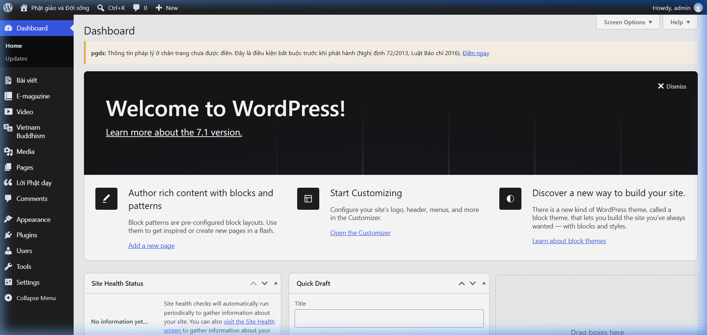

---

## 2. Tổng quan Thanh Menu Quản trị PGDS

Trên thanh menu bên trái màn hình sau khi đăng nhập thành công, hệ thống phân chia rõ ràng từng khu vực chuyên môn:

| Menu | Chức năng chính | Ảnh minh họa |
| :--- | :--- | :--- |
| **Dashboard** | Bảng điều khiển tổng quan thông số bài viết, bình luận và trạng thái hệ thống. | `01_dashboard.png` |
| **Bài viết** | Quản lý các bài viết tin tức thông thường (*Tin Phật sự, Sống an lành, Phật tích, Tốt đời đẹp đạo, Lối sống xanh...*). | `02_baiviet_list.png` |
| **E-magazine** | Đăng bài và trình trình bày bài viết dạng Tạp chí điện tử đồ họa cao cấp. | `04_emagazine_list.png` |
| **Video** | Quản lý các bài viết dạng Video (tự động đồng bộ từ YouTube). | `06_video_list.png` |
| **Vietnam Buddhism** | Quản lý danh mục bài viết tiếng Anh dành cho độc giả quốc tế. | `08_vietnambuddhism_list.png` |
| **Lời Phật dạy** | Quản lý trích dẫn triết lý Lời Phật dạy hiển thị ở sidebar và trang chủ. | `09_loiphatday_list.png` |
| **Comments** | Duyệt, phản hồi và xử lý các bình luận từ độc giả gửi về. | `10_comments_list.png` |
| **Media** | Thư viện tải lên và quản lý hình ảnh, tệp đính kèm. | `11_media_library.png` |

---

## 3. Hướng dẫn chi tiết Đăng bài viết theo từng Chuyên mục

### 🎬 3.1. Đăng bài Video (Chuyên mục Media > Video)

1. **Truy cập danh sách Video:** Chọn menu **Video** trên thanh sidebar trái.
   
   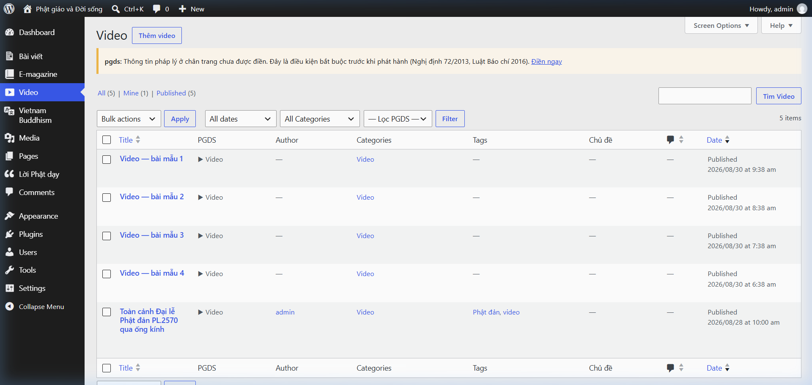

2. **Tạo bài viết Video mới:** Nhấn nút **Add New Video** (hoặc vào menu **Bài viết** ➔ **Viết bài mới**).
3. **Nhập thông tin Video:**
   - **Tiêu đề bài viết:** Điền tiêu đề bài video.
   - **Thẻ Video (Video YouTube):** Dán đường dẫn YouTube (VD: `https://www.youtube.com/watch?v=...`) hoặc Mã Video 11 ký tự.
     > 💡 **Tự động hóa:** Hệ thống tự động lấy tiêu đề, ảnh Poster Thumbnail và Thời lượng (Duration) từ YouTube.
   - **Chuyên mục chính:** Hệ thống chọn mặc định là `Video`.
   - **Sa-pô:** Nhập đoạn dẫn tóm tắt video.
   - **Tên tác giả hiển thị:** Nhập tên tác giả hoặc đơn vị thực hiện (VD: `Minh Anh`).

   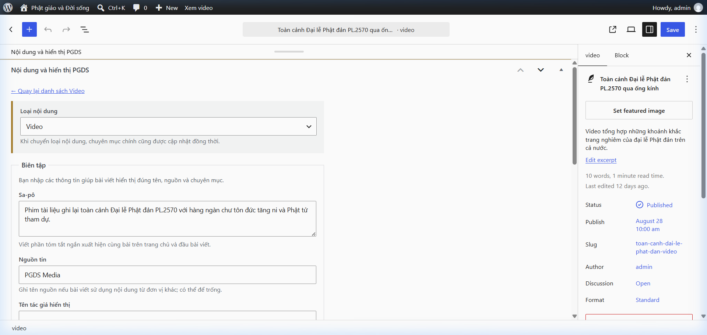

4. **Đăng bài:** Nhấn nút **Publish (Đăng bài)** ở góc phải trên.

---

### 📖 3.2. Đăng bài Tạp chí Điện tử (E-magazine) — Hướng dẫn chi tiết

#### 🎯 Mục đích & Đặc điểm bài viết E-magazine:
Bài viết **E-magazine** là các tác phẩm báo chí chuyên sâu đa phương tiện (*Multimedia Journalism*). Trang chi tiết E-magazine được thiết kế với không gian hiển thị mở rộng (Wide / Full width), phông chữ nghệ thuật, khối trích dẫn nổi bật và các bộ ảnh đôi/ảnh tràn màn hình mang lại trải nghiệm xem như một tạp chí in cao cấp.

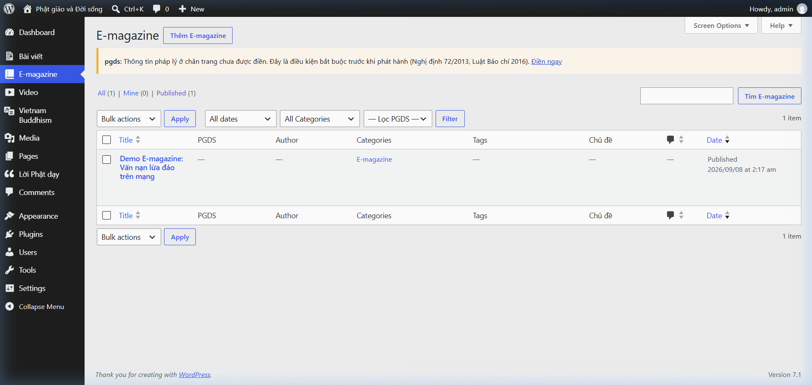

#### 📝 Quy trình 5 bước đăng bài E-magazine chuẩn:

1. **Bước 1: Khởi tạo bài viết E-magazine mới:**
   - Trên menu quản trị bên trái, chọn **E-magazine** ➔ nhấn nút **Add New E-magazine** (hoặc truy cập **Bài viết** ➔ **Viết bài mới**).

2. **Bước 2: Nhập Tiêu đề & Cấu hình thuộc tính PGDS:**
   - **Tiêu đề bài viết:** Nhập tiêu đề lớn tác phẩm E-magazine.
   - **Khung cấu hình PGDS (ở cột phải hoặc bên dưới bài viết):**
     - **Chuyên mục chính:** Đảm bảo hệ thống chọn `E-magazine` (Tuyệt đối không đổi sang chuyên mục khác để giữ đúng layout E-magazine).
     - **Sa-pô (Tóm tắt):** Nhập đoạn mở đầu ngắn gọn, ấn tượng dẫn dắt độc giả.
     - **Tên tác giả hiển thị:** Điền tên Biên tập viên / Nhiếp ảnh gia thực hiện (VD: `Nguyễn Văn A - Ảnh: Hoàng Nam`).

3. **Bước 3: Tải Ảnh đại diện Bìa (Featured Image):**
   - Ở cột cấu hình bên phải, tìm đến mục **Ảnh đại diện (Featured Image)**.
   - Chọn ảnh chất lượng cao độ phân giải tối thiểu `1920x1080px` làm ảnh bìa chính (Banner Header) cho E-magazine.

4. **Bước 4: Sử dụng 5 Mẫu Gutenberg Block Patterns E-magazine chuẩn (Kèm ảnh chụp thực tế từng ô):**

   Nhấn vào nút biểu tượng **`+` (Add Block)** ở góc trên bên trái trình soạn thảo Gutenberg ➔ chuyển sang tab **Patterns (Mẫu định dạng)** ➔ chọn nhóm **PGDS E-magazine**.

   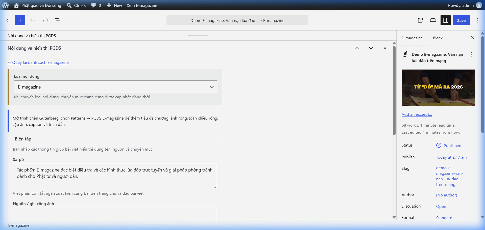

   Chi tiết 5 mẫu thiết kế E-magazine chuyên dụng với thông tin điền mẫu thực tế:

   ---

   📌 **Mẫu 1: Chapter Heading (Tiêu đề Chương / Phân đoạn)**
   - **Công dụng:** Chia bài viết E-magazine dài thành các chương hoặc phân đoạn chủ đề nhỏ giúp độc giả dễ theo dõi.
   - **Cấu trúc mẫu:** Chữ *"Chương 01"*, *"Chương 02"* phía trên kèm thẻ Tiêu đề H2 lớn phía dưới.
   - **Thông tin điền mẫu trong hệ thống:**
     - *Chữ phân đoạn:* `Chương 01`
     - *Tiêu đề chương:* `Hành trình Khai sáng và Nhận thức Tự tính`

   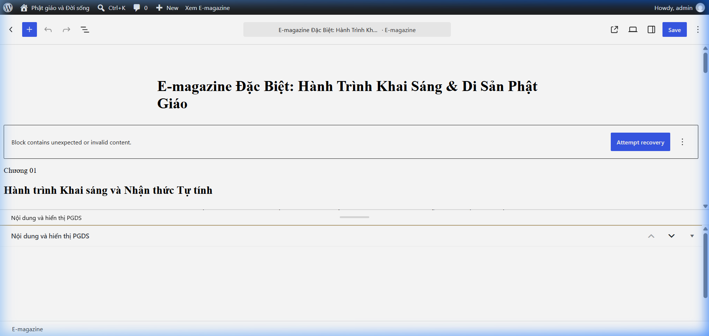

   ---

   📌 **Mẫu 2: Pull Quote (Khối trích dẫn nổi bật)**
   - **Công dụng:** Đóng khung câu nói hay, triết lý hoặc thông điệp quan trọng nhất trong bài viết.
   - **Định dạng:** Chữ trích dẫn khổ lớn nghệ thuật kèm tên nhân vật/nguồn trích dẫn phía dưới.
   - **Thông tin điền mẫu trong hệ thống:**
     - *Nội dung trích dẫn:* `"Giữ tâm thanh tịnh giữa biến động cuộc đời chính là suối nguồn của sự an lạc vĩnh hằng."`
     - *Nguồn trích dẫn / Tác giả:* `Thượng tọa Thích Thanh Từ — Thiền viện Trúc Lâm`

   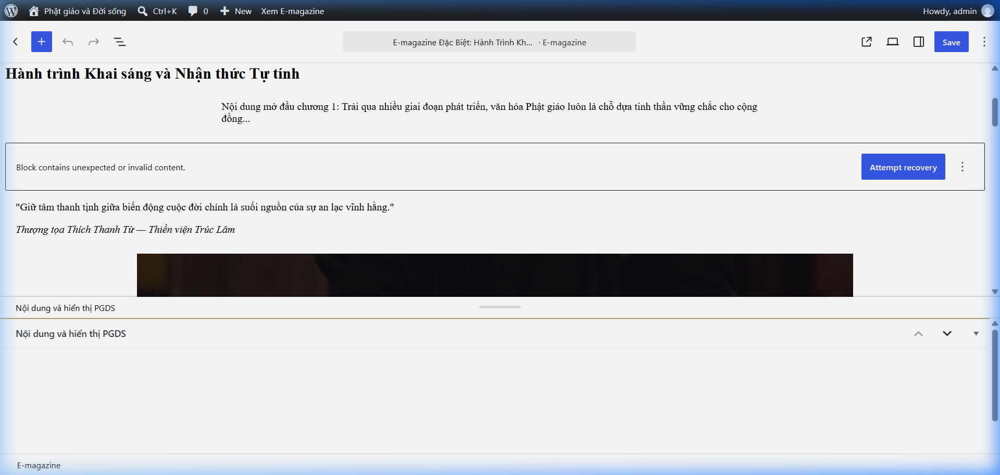

   ---

   📌 **Mẫu 3: Wide Image (Ảnh tràn chiều rộng - Wide Width)**
   - **Công dụng:** Chèn bức ảnh khổ rộng vươn ra 2 bên lề cột nội dung chính bài viết.
   - **Thông tin điền mẫu trong hệ thống:**
     - *Ảnh tải lên:* Ảnh khung cảnh lễ hội / sự kiện chất lượng cao.
     - *Chú thích ảnh & Nguồn:* `Ảnh 1: Quang cảnh Đại lễ Vesak rực rỡ sắc màu tâm linh — Ảnh: Ban Biên Tập PGDS`

   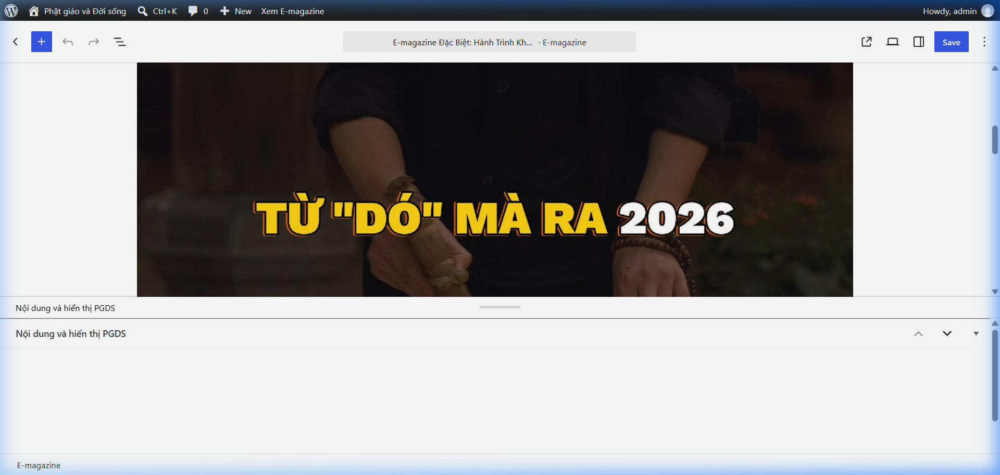

   ---

   📌 **Mẫu 4: Image Pair (Bộ ảnh đôi 2 cột)**
   - **Công dụng:** Hiển thị 2 bức ảnh song song cạnh nhau trên 2 cột kèm chú thích độc lập cho từng ảnh.
   - **Thông tin điền mẫu trong hệ thống:**
     - *Ảnh bên trái & Chú thích:* `Ảnh trái: Nghi lễ dâng hoa cầu nguyện bình an cho vạn chúng`
     - *Ảnh bên phải & Chú thích:* `Ảnh phải: Chư tôn đức tăng ni thực hiện nghi thức thắp nến hoa đăng`

   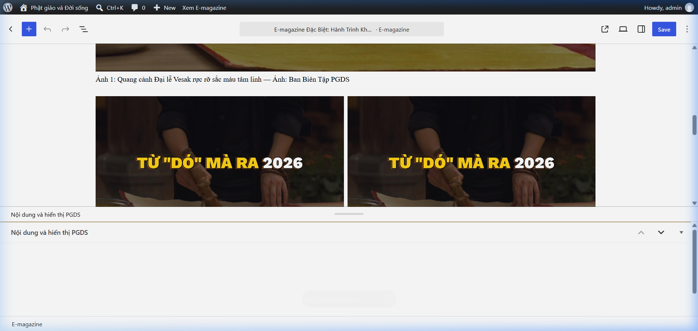

   ---

   📌 **Mẫu 5: Full Image (Ảnh tràn toàn màn hình - Full Width)**
   - **Công dụng:** Chèn bức ảnh điểm nhấn vươn tràn 100% toàn bộ chiều rộng màn hình thiết bị độc giả.
   - **Thông tin điền mẫu trong hệ thống:**
     - *Ảnh tải lên:* Ảnh panorama toàn cảnh góc rộng nét cao.
     - *Chú thích ảnh & Tác giả:* `Ảnh tràn toàn màn hình: Toàn cảnh không gian linh thiêng từ trên cao — Tác giả: Phóng viên Hoàng Nam`

   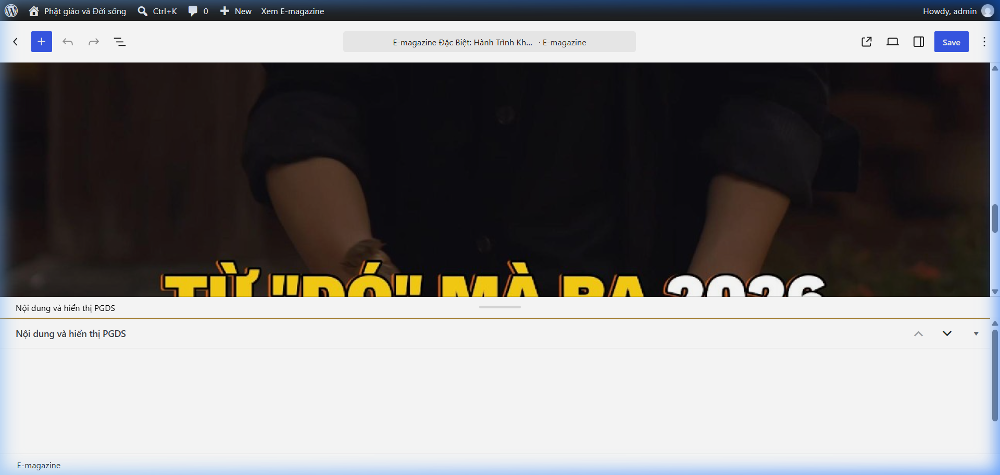

   ---

5. **Bước 5: Xem trước & Xuất bản:**
   - Nhấn nút **Xem trước (Preview)** ở góc trên bên phải để xem thử hiển thị E-magazine.
   - Nhấn nút **Publish (Đăng bài)** để phát hành bài viết E-magazine công khai.

---

### 📰 3.3. Đăng bài Tin tức thông thường (Tin Phật sự, Sống an lành, Phật tích...)

1. **Truy cập:** Chọn menu **Bài viết (Posts)** ➔ Danh sách toàn bộ tin tức hiển thị.

   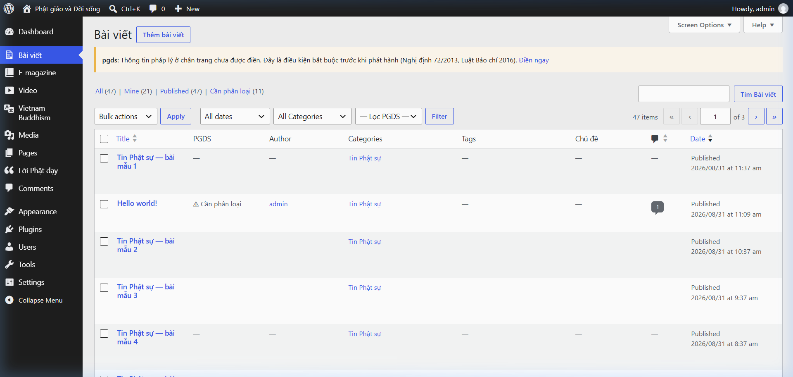

2. **Nhấn Viết bài mới (Add New):**

   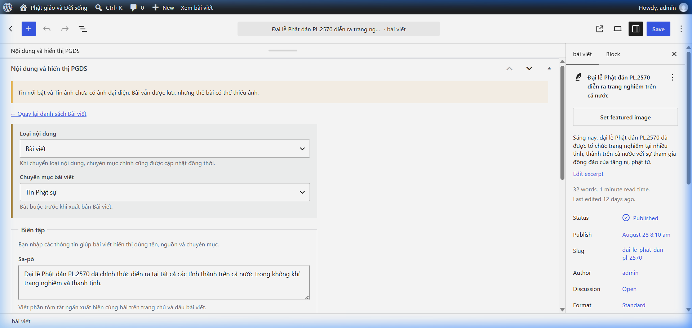

3. **Nhập dữ liệu:**
   - **Tiêu đề & Nội dung:** Điền tiêu đề và soạn nội dung chi tiết.
   - **Chuyên mục (Categories):** Tích chọn chuyên mục phù hợp (*Tin Phật sự, Phật tích, Lối sống xanh, Tốt đời đẹp đạo...*).
   - **Cấu hình PGDS:** Nhập Sa-pô, chọn Chuyên mục chính hiển thị, và nhập Tên tác giả hiển thị.
4. **Đăng bài:** Nhấn **Publish (Đăng bài)**.

---

### 🌏 3.4. Đăng bài Tiếng Anh (Vietnam Buddhism)

1. **Truy cập:** Chọn menu **Vietnam Buddhism** trên thanh điều hướng.

   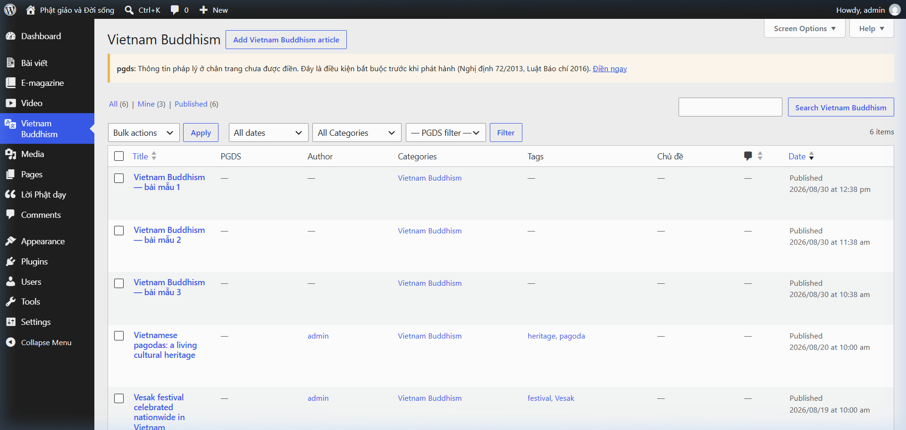

2. **Soạn bài viết:**
   - Nhập Tiêu đề & Nội dung bài viết bằng Tiếng Anh.
   - Chuyên mục chính mặc định chọn `Vietnam Buddhism`.
   - Điền Sa-pô và Tác giả bài viết.
3. **Đăng bài:** Nhấn **Publish**.

---

## 4. Quản lý Nội dung bổ sung

### ☸️ 4.1. Quản lý Lời Phật dạy

1. Chọn menu **Lời Phật dạy** trên thanh Admin.

   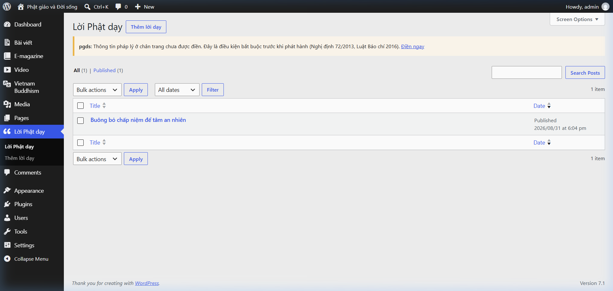

2. Nhấn nút **Thêm lời dạy** để tạo mới câu trích dẫn triết lý Lời Phật dạy hiển thị ở khối Sidebar và Trang chủ.

---

### 💬 4.2. Quản lý Bình luận độc giả (Comments)

1. Vào menu **Comments (Bình luận)**.

   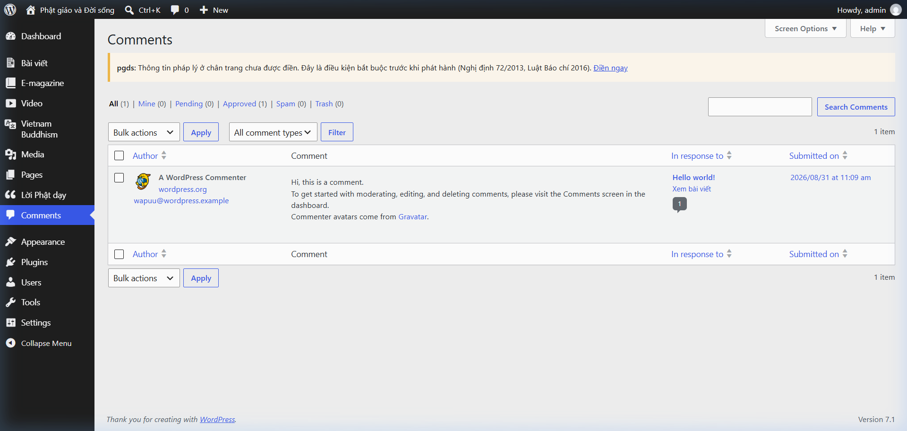

2. Rê chuột vào từng bình luận để thực hiện các thao tác:
   - **Approve:** Duyệt hiển thị công khai bình luận.
   - **Reply:** Trả lời trực tiếp bình luận của độc giả.
   - **Spam / Trash:** Loại bỏ bình luận rác hoặc xóa khỏi hệ thống.

---

### 🖼️ 4.3. Quản lý Thư viện Media (Thư viện tệp)

1. Chọn menu **Media** ➔ chọn **Thư viện (Library)**.

   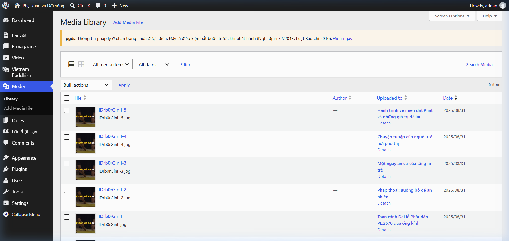

2. Tải lên, tìm kiếm, chỉnh sửa thông tin hoặc xóa hình ảnh/tệp đính kèm.

---

## 5. Lưu ý quan trọng dành cho Biên tập viên

- **Định dạng thời gian công bố:** Hệ thống hiển thị chuẩn `YYYY-MM-DD HH:mm:ss` (Ví dụ: `2026-09-08 22:46:00`).
- **Tên tác giả:** Nhập trực tiếp tên tác giả trong ô cấu hình PGDS, hệ thống hiển thị chính xác tên tác giả mà không tự thêm từ *"Theo"* phía trước.
- **Chuyên mục chính (Primary Category):** Luôn kiểm tra ô chọn *Chuyên mục chính* để định vị chính xác bài viết xuất hiện ở trang giao diện tương ứng.
