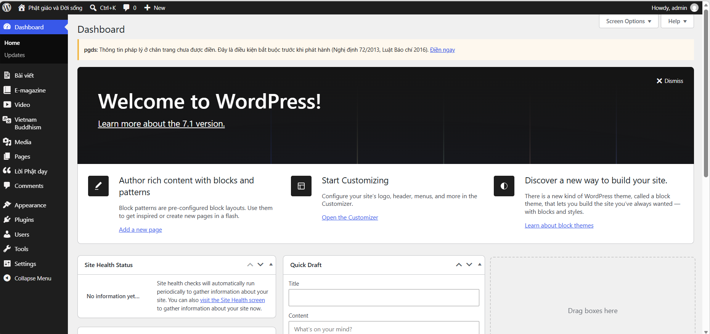
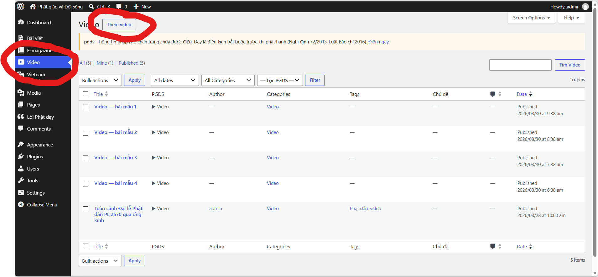
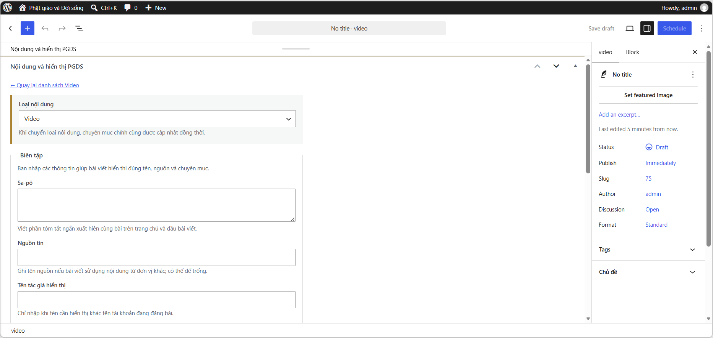

# Hướng Dẫn Sử Dụng Trang Quản Trị Admin (PGDS - Hệ Thống Tin Tức Phật Giáo)

Tài liệu hướng dẫn chi tiết quy trình đăng bài, quản lý nội dung và sử dụng các tính năng trên Trang Quản trị (Admin Dashboard) của hệ thống CMS PGDS.

---

## 1. Đăng nhập trang Quản trị (Admin Dashboard)

- **Đường dẫn truy cập trang quản trị (URL):** 👉 [http://localhost:8080/wp-admin](http://localhost:8080/wp-admin)
- **Tài khoản đăng nhập mặc định:**
  - **Tên đăng nhập (Username):** `admin`
  - **Mật khẩu (Password):** `admin123`

---

## 2. Tổng quan Thanh Menu Quản trị PGDS

Trên thanh menu bên trái màn hình sau khi đăng nhập thành công:

| Menu | Chức năng chính |
| :--- | :--- |
| **Dashboard** | Bảng điều khiển tổng quan thông số bài viết, bình luận và trạng thái hệ thống. |
| **Bài viết** | Quản lý các bài viết tin tức thông thường (*Tin Phật sự, Sống an lành, Phật tích, Tốt đời đẹp đạo, Lối sống xanh...*). |
| **E-magazine** | Đăng bài và trình bày bài viết dạng Tạp chí điện tử đồ họa cao cấp. |
| **Video** | Quản lý các bài viết dạng Video (tự động đồng bộ từ YouTube). |
| **Vietnam Buddhism** | Quản lý danh mục bài viết tiếng Anh dành cho độc giả quốc tế. |
| **Media** | Thư viện tải lên và quản lý hình ảnh, tệp đính kèm. |
| **Pages** | Quản lý các trang tĩnh (*Giới thiệu, Liên hệ, Quy định bảo mật, Điều khoản...*). |
| **Lời Phật dạy** | Quản lý trích dẫn triết lý Lời Phật dạy hiển thị ở sidebar và trang chủ. |
| **Comments** | Duyệt, phản hồi và xử lý các bình luận từ độc giả gửi về. |

---

## 3. Hướng dẫn chi tiết Đăng bài viết theo từng Chuyên mục

### 🎬 3.1. Đăng bài Video (Chuyên mục Media > Video)

1. **Truy cập:** Chọn menu **Video** ➔ chọn **Add New Video** (hoặc menu **Bài viết** ➔ **Viết bài mới**).
2. **Nhập Tiêu đề:** Điền tiêu đề video rõ ràng, hấp dẫn.
3. **Cấu hình khối "Nội dung và hiển thị PGDS":**
   - **Thẻ Video (Video YouTube):** Dán liên kết Video YouTube (ví dụ: `https://www.youtube.com/watch?v=...`) hoặc Mã ID 11 ký tự của Video.
     > 💡 **Tự động hóa:** Hệ thống sẽ tự động đồng bộ Thời lượng (Duration), Ảnh đại diện Poster và Tiêu đề từ YouTube nếu hợp lệ.
   - **Chuyên mục chính:** Chọn `Video`.
   - **Sa-pô:** Nhập đoạn mô tả / tóm tắt ngắn cho video.
   - **Tên tác giả hiển thị:** Nhập tên tác giả hoặc đơn vị thực hiện video (Ví dụ: `Minh Anh`).

4. **Đăng bài:** Nhấn nút **Publish (Đăng bài)** ở cột phải.

---

### 📖 3.2. Đăng bài Tạp chí Điện tử (E-magazine)

1. **Truy cập:** Chọn menu **E-magazine** ➔ chọn **Add New E-magazine** (hoặc menu **Bài viết** ➔ **Viết bài mới**).
2. **Nhập Tiêu đề:** Nhập tiêu đề lớn cho E-magazine.
3. **Soạn thảo Nội dung bài viết với Gutenberg Patterns:**
   - Trong giao diện soạn thảo Gutenberg, nhấn nút `+` (Add Block) ➔ chọn tab **Patterns** (Mẫu định dạng).
   - Chọn nhóm mẫu **PGDS E-magazine** với các mẫu chuẩn bị sẵn:
     - *Wide Image (Hình ảnh hiển thị tràn chiều rộng)*
     - *Pull Quote (Trích dẫn nổi bật)*
     - *Image Pair (Cặp ảnh đôi song song)*
     - *Chapter Heading (Tiêu đề phân đoạn/Chương bài viết)*
     - *Full Image (Ảnh toàn màn hình)*
4. **Cấu hình thuộc tính:**
   - **Chuyên mục chính:** Tích chọn `E-magazine`.
   - **Sa-pô:** Nhập đoạn dẫn dắt mở đầu E-magazine.
   - **Tên tác giả hiển thị:** Nhập tên biên tập viên / nhiếp ảnh gia.
   - **Ảnh đại diện (Featured Image):** Đặt ảnh đại diện sắc nét chất lượng cao làm ảnh bìa Banner E-magazine.
5. **Đăng bài:** Nhấn **Publish (Đăng bài)**.

---

### 📰 3.3. Đăng bài Tin tức thông thường (Tin Phật sự, Sống an lành, Phật tích...)

1. **Truy cập:** Chọn menu **Bài viết (Posts)** ➔ chọn **Viết bài mới (Add New)**.
2. **Nhập Tiêu đề & Nội dung:** Soạn thảo tiêu đề bài viết và nội dung đầy đủ.
3. **Cấu hình bài viết ở cột phải:**
   - **Chuyên mục (Categories):** Tích chọn chuyên mục tương ứng (*Tin Phật sự, Phật tích, Lối sống xanh, Tốt đời đẹp đạo...*).
   - **Ảnh đại diện (Featured Image):** Tải ảnh minh họa bài viết.
   - **Khung "Nội dung và hiển thị PGDS":**
     - **Sa-pô:** Điền sa-pô tóm tắt bài viết.
     - **Chuyên mục chính:** Chọn chuyên mục hiển thị ưu tiên.
     - **Tên tác giả hiển thị:** Nhập tên tác giả bài viết.
4. **Đăng bài:** Nhấn **Publish (Đăng bài)**.

---

### 🌏 3.4. Đăng bài Tiếng Anh (Vietnam Buddhism)

1. **Truy cập:** Chọn menu **Vietnam Buddhism** ➔ chọn **Add New**.
2. **Nhập Tiêu đề & Nội dung:** Soạn thảo tiêu đề và nội dung bằng tiếng Anh.
3. **Cấu hình:**
   - **Chuyên mục chính:** Chọn `Vietnam Buddhism`.
   - **Sa-pô & Tác giả:** Điền tóm tắt bằng tiếng Anh và tên tác giả.
4. **Đăng bài:** Nhấn **Publish (Đăng bài)**.

---

## 4. Quản lý Quản trị Nội dung bổ sung

### ☸️ 4.1. Quản lý Lời Phật dạy

1. Chọn menu **Lời Phật dạy** trên thanh Admin.
2. Bạn có thể xem danh sách các câu trích dẫn Lời Phật dạy đã có.
3. Nhấn **Thêm lời dạy** để tạo lời dạy mới:
   - **Tiêu đề:** Nhập tên câu trích dẫn hoặc tiêu đề lời dạy.
   - **Nội dung:** Soạn thảo câu nói / triết lý của Đức Phật.
4. Lời dạy xuất hiện ngẫu nhiên hoặc theo thứ tự trên khối Sidebar và Trang chủ website.

---

### 💬 4.2. Quản lý Bình luận độc giả (Comments)

1. Vào menu **Comments (Bình luận)**.
2. Danh sách bình luận từ độc giả được phân loại thành:
   - **Pending (Chờ duyệt):** Bình luận mới cần biên tập viên kiểm duyệt trước khi hiển thị công khai trên website.
   - **Approved (Đã duyệt):** Bình luận đã được xuất bản công khai dưới bài viết.
   - **Spam / Trash:** Báo cáo bình luận rác hoặc chuyển vào thùng rác.
3. Bạn có thể rê chuột vào từng bình luận để nhấn **Approve (Duyệt)**, **Reply (Trả lời trực tiếp)**, **Edit (Sửa nội dung)** hoặc **Trash (Xóa)**.

---

### 🖼️ 4.3. Quản lý Thư viện Media (Thư viện tệp)

1. Chọn menu **Media** ➔ chọn **Library (Thư viện)** hoặc **Add New (Thêm mới)**.
2. Tải lên ảnh bài viết, banner, poster video, tệp tài liệu.
3. Hệ thống tự động tối ưu hóa hình ảnh hiển thị mượt mà trên thiết bị di động và máy tính bảng.

---

## 5. Lưu ý quan trọng cho Biên tập viên

- **Định dạng thời gian công bố:** Bài viết đăng sẽ hiển thị ngày giờ xuất bản theo định dạng chuẩn `YYYY-MM-DD HH:mm:ss` (ví dụ: `2026-09-08 22:46:00`).
- **Tác giả bài viết:** Nhập tên tác giả trực tiếp trong khung cấu hình PGDS. Giao diện hiển thị góc phải bài viết sẽ thể hiện đúng tên tác giả (không tự động thêm từ *"Theo"* phía trước).
- **Phân loại Chuyên mục chính (Primary Category):** Luôn kiểm tra kỹ ô chọn *Chuyên mục chính* trong khung cấu hình PGDS để đảm bảo bài viết nằm đúng khu vực giao diện mong muốn (Video, E-magazine, Tin Phật sự, v.v.).
